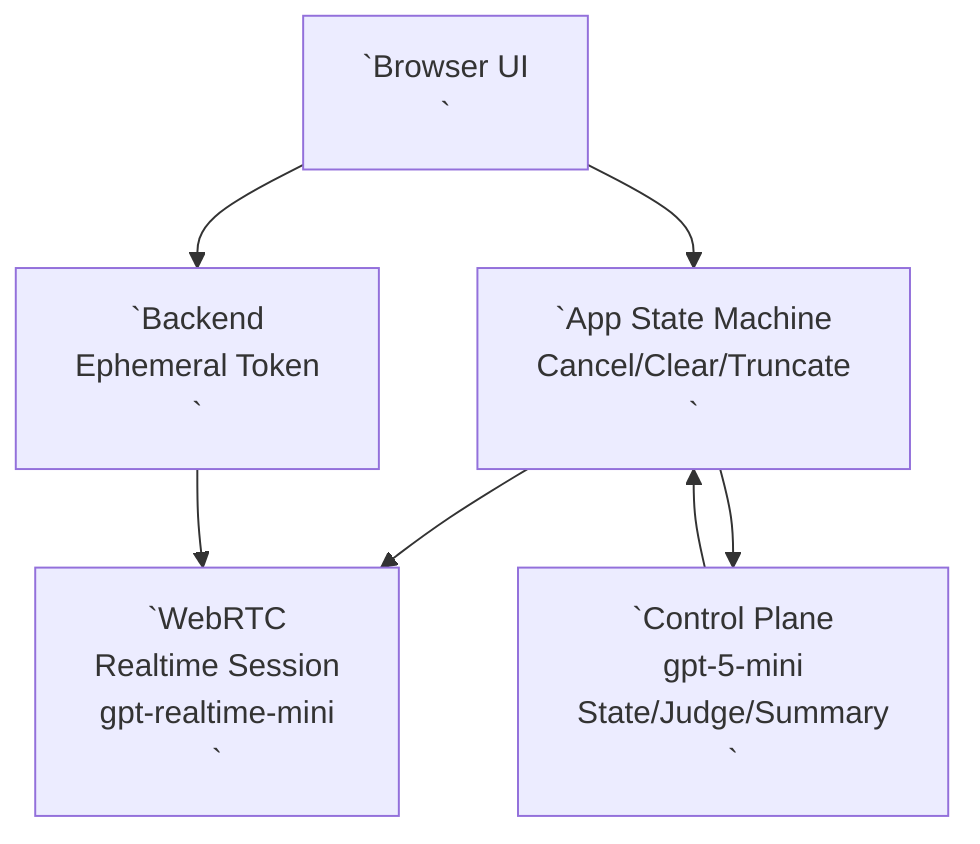

---

name: voice-proxy-negotiator-design
description: 英語語音「代客協商」Web App 之技術設計（Realtime 事件流、狀態機、記憶治理、UX、測試鉤子）。
--------------------------------------------------------------------

# Voice Proxy Negotiator — Design

## 1. 系統概觀

🔎 架構採「前端 WebRTC Realtime + 後端 Ephemeral Token + 文字控制平面（gpt-5-mini）」三層分工，以保低延遲與可治理。

* Realtime 平面：`gpt-realtime-mini` 負責聽/講（英語語音互動） ([gpt-realtime-mini Model | OpenAI API](https://platform.openai.com/docs/models/gpt-realtime-mini))
* Control 平面：`gpt-5-mini` 負責狀態機、達標判定、記憶壓縮、風險守門 ([GPT-5 mini Model | OpenAI API](https://platform.openai.com/docs/models/gpt-5-mini))
* App 平面：事件協調（interrupt、停止條件、按鈕指令、上下文壓縮與回灌）

### Control 平面 API 端點

🔎 `gpt-5-mini` 使用 **Responses API**（`/v1/responses`），這是 OpenAI 新一代 API，取代舊的 Chat Completions API。參考：[Responses | OpenAI API Reference](https://platform.openai.com/docs/api-reference/responses)、[Why we built the Responses API](https://developers.openai.com/blog/responses-api/)

**關鍵特性**：
- **Reasoning State Preservation**：保留推理狀態跨回合
- **Hosted Tools**：伺服器端執行工具（web search、image gen、MCP）
- **Direct File Input**：支援直接輸入 PDF 等檔案（v2 可用於 SSOT RAG）

**基本調用**：
```http
POST https://api.openai.com/v1/responses
Authorization: Bearer {OPENAI_API_KEY}
Content-Type: application/json

{
  "model": "gpt-5-mini-2025-08-07",
  "instructions": "...",
  "input": [
    {
      "role": "user",
      "content": [{"type": "input_text", "text": "..."}]
    }
  ]
}
```

## 1.1 技術棧（Tech Stack）

🔎 v1 採用「最小依賴、快速驗證」原則，優先 Vanilla JS + Python，避免複雜框架。

### 前端
- **語言**：Vanilla JavaScript (ES6+)
- **UI**：HTML5 + CSS3（繁體中文字體：Noto Sans TC / Microsoft JhengHei）
- **WebRTC**：原生 Web API（`RTCPeerConnection`、`MediaStream`）
- **Token 估算**：`tiktoken` (WASM) 或簡化公式（避免後端依賴）

### 後端
- **語言**：Python 3.10+
- **框架**：FastAPI（異步支援、自動 API 文檔）
- **依賴**：
  - `openai` (官方 SDK)
  - `uvicorn` (ASGI server)
  - `python-dotenv` (環境變數管理)
  - `fastapi-cors` (CORS 中間件，內建於 FastAPI)

**FastAPI CORS 配置**（`src/backend/main.py`）：
```python
from fastapi import FastAPI
from fastapi.middleware.cors import CORSMiddleware

app = FastAPI()

app.add_middleware(
    CORSMiddleware,
    allow_origins=[
        "http://localhost:*",
        "http://127.0.0.1:*",
        "http://[::1]:*"  # IPv6 localhost
    ],
    allow_credentials=False,  # v1 不使用 cookies
    allow_methods=["GET", "POST", "OPTIONS"],
    allow_headers=["Content-Type", "Authorization"],
    expose_headers=["Content-Length"],
    max_age=86400  # 24 小時預檢緩存
)
```

**注意事項**：
- `allow_origins` 使用通配符需 `allow_credentials=False`
- 如需精確控制，改用具體端口：`["http://localhost:3000", "http://localhost:5173"]`（Vite 默認端口）

### 開發環境
- **OS**：Windows 10/11（參考 `src/skills/windows-python/SKILL.md`）
- **Python 環境**：Conda (`adamlab4_env`)
- **瀏覽器**：Chrome 100+ / Edge 100+（優先）

### 目錄結構（建議）
```
voice-proxy-negotiator/
├── spec/                    # 規格文件（已有）
├── src/
│   ├── frontend/            # 前端代碼
│   │   ├── setup_page.html
│   │   ├── conversation_page.html
│   │   ├── app.js           # 主邏輯
│   │   ├── state_machine.js
│   │   ├── session_manager.js
│   │   ├── token_estimator.js
│   │   └── styles.css
│   ├── backend/             # 後端代碼
│   │   ├── main.py          # FastAPI 入口
│   │   ├── controller.py    # gpt-5-mini 控制器
│   │   ├── token_service.py # Ephemeral token 生成
│   │   └── prompt_templates.py
│   ├── spike/               # M0 可行性驗證代碼
│   └── tests/               # 測試代碼
├── reports/                 # 測試報告輸出
└── .env.example             # 環境變數模板
```

### Controller 調用路徑（安全設計）

🔎 前端**不得**直接調用 OpenAI API（避免暴露 API key），必須通過後端代理。

**流程**：
```
用戶按按鈕
  ↓
前端 POST /api/controller
  ↓
後端 controller.py 調用 Responses API (/v1/responses)
  ↓
返回策略指令給前端
  ↓
前端注入到 Realtime session
```

#### `POST /api/controller`
生成下一句策略指令。

**請求**：
```json
{
  "directive": "AGREE",
  "pinned_context": "Goal: ...\nRules: ...",
  "memory": "Current summary...",
  "latest_turns": ["Human: ...", "Assistant: ..."]
}
```

**響應**：
```json
{
  "decision": "continue",
  "next_english_utterance": "I agree with your proposal. Let's move forward.",
  "memory_update": "Updated summary...",
  "notes_for_user": null
}
```

## 2. Realtime Model 選型（Quality / Speed / Cost）

🔎 `gpt-realtime-mini` 以「Very fast + 成本較低」作預設；`gpt-realtime` 只保留作未來升級選項（不在 v1 使用）。 ([OpenAI Platform][3])
比較重點（已核對）：

* `gpt-realtime`：Highest / Fast / 價格顯著較高，32k context，4,096 max output ([OpenAI Platform][1])
* `gpt-realtime-mini`：Higher / Very fast / 較低成本，32k context，4,096 max output，無 structured outputs ([OpenAI Platform][3])

## 3. 事件流與中斷處理（Interruptions / VAD）

🔎 Barge-in 的標準動作序列：`response.cancel` → `output_audio_buffer.clear`（WebRTC/SIP）→（需要時）`conversation.item.truncate`。 ([OpenAI Platform][5])

### 3.1 Turn detection（建議配置）

🔎 優先使用 `semantic_vad` 並開啟 `interrupt_response`，讓對方開口即自然打斷。 ([OpenAI Platform][2])
建議：

* `turn_detection.type = "semantic_vad"`
* `turn_detection.interrupt_response = true`
* `turn_detection.create_response = true`

### 3.2 Cancel / Clear / Truncate

🔎 `response.cancel` 用於取消正在生成的回應；若無 in-progress 亦可呼叫（最多回 error，但 session 不受影響）。 ([OpenAI Platform][5])
🔎 `output_audio_buffer.clear` 用於切斷正在播放的音訊（WebRTC/SIP），且建議先做 `response.cancel`。 ([OpenAI Platform][9])
🔎 `conversation.item.truncate` 用於把「已送出但未播放/未完整播放」的 assistant 音訊裁切，並同步伺服器上下文（避免模型以為對方已聽到）。 ([OpenAI Platform][5])

## 4. 狀態機（App Layer State Machine）

🔎 Realtime 不提供 structured outputs，故狀態機必須在 App 層實作，並由 `gpt-5-mini` 提供判定與建議。 ([OpenAI Platform][3])

### 4.1 狀態定義（建議）

* `INIT`：載入設定、建立 session
* `LISTENING`：等待對方發言（VAD）
* `THINKING`：生成下一句策略（含按鈕指令）
* `SPEAKING`：輸出英語語音（可被 interrupt）
* `CHECKPOINT`：`gpt-5-mini` 更新摘要、檢查達標/風險
* `STOPPING`：收尾、釋放資源
* `STOPPED`：完成

### 4.2 兩層記憶（Pinned + Rolling）

🔎 「任務目標/硬約束」作 Pinned Context 永久保留；「對話要點」作 Rolling Summary 定期壓縮，避免 32k context 壓力導致失焦。

* **Pinned Context**：Goal、不可承諾事項、SSOT 摘要（目標長度：≤ 1,500 tokens）
* **Rolling Summary**：已達成共識、未決議題、對方條件、下一步策略（目標長度：≤ 1,000 tokens）
* **Recent Turns**：只保留最近 **3 輪**原文（供語氣自然，約 500–1,000 tokens）

### SSOT 摘要策略（v1 規範）

🔎 用戶在設定頁貼入 SSOT（最多 5,000 字元），如超過 1,500 tokens，需在對話開始前壓縮成 Pinned Context。

**壓縮時機**：
- 用戶點擊「開始對話」按鈕時
- 前端估算 SSOT tokens（使用 `token_estimator.js`）
- 如 > 1,500 tokens，調用後端 `/api/summarize_ssot`

**壓縮方法**：
- 後端調用 `gpt-5-mini` (Responses API)
- Instruction：「總結以下資料為關鍵要點清單（bullet points），保留所有數字、日期、條款編號，目標長度 1,500 tokens 以內」
- 返回摘要後存入 Pinned Context

**API 規格**：

#### `POST /api/summarize_ssot`
```json
// 請求
{
  "ssot_text": "原始 SSOT 內容..."
}

// 響應
{
  "summary": "摘要後的 SSOT...",
  "original_tokens": 3200,
  "summary_tokens": 1400
}
```

## 5. 「用戶即時引導」設計（Button-to-Policy）

🔎 用戶按鈕不直接「控制 Realtime 講稿」，而是注入「策略/立場指令」到 Control 平面，生成下一句短句後交回 Realtime 播放。
方法：

1. UI 產生 `directive`（例如：`AGREE_SOFTLY`、`NEED_TIME`、`SAY_GOODBYE`）
2. App 將 directive + 最新對話摘要送 `gpt-5-mini`
3. `gpt-5-mini` 輸出：下一句/下一輪「英語短句 plan」（1–2 句為主）+ 更新後摘要 + 是否達標
4. App 將短句 plan 以 `system` message 注入 Realtime，然後由 Realtime 自然語音化（保持低延遲）

### Controller 調用時機（v1 策略）

🔎 為保「低延遲」，Controller 不在「每個 turn」都調用，而是：

- **觸發時機 A（用戶按按鈕）**：立即調用 Controller 生成策略指令
- **觸發時機 B（每 N 輪或達警戒線）**：定期壓縮摘要（例如每 5 輪或 token 達 70%）
- **不觸發**：對方正常說話 → Realtime 自動回應（VAD + auto-response）

### Realtime 的自主回應 vs Controller 引導

- **正常對話流**：Realtime 依 `instructions` 和最近上下文自主回應（低延遲）
- **用戶介入時**：Controller 注入策略指令（例如：「Next, politely decline and suggest alternative」），Realtime 依此調整語氣與內容

### 按鈕映射表存儲（v1 規範）

🔎 按鈕映射表（繁中顯示文字 ↔ 英文 Directive ID）存儲在**前端 sessionStorage**（臨時），對話結束後清除。

**存儲時機**：
- 用戶在設定頁配置按鈕（v1 使用默認映射，參考 `requirements.md` § 5.2）
- 點擊「開始對話」時寫入 sessionStorage

**數據結構**：
```javascript
sessionStorage.setItem('button_mapping', JSON.stringify({
  "同意": "AGREE",
  "不同意": "DISAGREE",
  "我需要時間考慮": "NEED_TIME",
  // ...
}));
```

**v2 規劃**：支援用戶自定義按鈕與映射，存儲到後端數據庫（持久化）

### Controller 狀態管理方式（v1 規範）

🔎 使用 `previous_response_id` 模式（無狀態），避免伺服器端保存會話狀態，便於除錯與重播。參考：`src/skills/openai-gpt5-mini-controller/SKILL.md:63-68`

**調用模式**：
```json
{
  "model": "gpt-5-mini-2025-08-07",
  "instructions": "...",
  "input": [...],
  "previous_response_id": "resp_abc123"  // 上一次調用的 response ID
}
```

**好處**：
- 前端/App 層完全控制狀態（pinned_context + memory + recent_turns）
- 後端無狀態，易於水平擴展
- 可重播測試（提供相同輸入即可復現）

**注意**：不使用 `conversation` 參數（與 `previous_response_id` 互斥）

## 6. 停止條件（Stop Conditions）

🔎 停止由 App 層仲裁：用戶按「達標/停止」或觸發 Magic Word 即進入 STOPPING；另外可由 `gpt-5-mini` 判定「已達標」。

### 停止條件優先級（v1 規範）

1. **Hard stop（最高優先級）**：
   - 用戶按「立即停止」按鈕
   - 動作：`response.cancel` + `output_audio_buffer.clear`，立即切斷，無 goodbye ([OpenAI Platform][5])

2. **Soft stop（次優先級）**：
   - 用戶按「達標」按鈕 **OR**
   - 用戶說出 Magic Word（由 App 檢測 transcript）**OR**
   - `gpt-5-mini` 判定 `decision: "stop"`（達標）
   - 動作：注入 goodbye 策略指令，播放後結束

### 衝突解決（v1 規範）

- **用戶按「達標」但 Controller 判定「未達標」**：
  - 以**用戶為準**（用戶最終決策權）
  - Controller 記錄 `notes_for_user: "警告：目標可能未完全達成"`
  - 進入 Soft stop

- **Controller 判定「達標」但用戶未按按鈕**：
  - **不自動停止**（避免誤判）
  - UI 彈出提示：「系統判定可能已達標，是否結束？」（需用戶確認）

### Magic Word 檢測（v1 規範）

🔎 Magic Word 由用戶在設定頁定義（例如「紅色警報」），用於緊急觸發 Soft stop。

**檢測邏輯**：
- **檢測時機**：每次收到 Realtime 的 `conversation.item.created`（role=user）事件
- **檢測方式**：對 transcript 進行**不區分大小寫**的子字串匹配
- **匹配規則**：
  - 英文：`transcript.toLowerCase().includes(magicWord.toLowerCase())`
  - 支援多個 Magic Word（用逗號分隔），任一匹配即觸發
- **觸發動作**：進入 Soft stop（同「是時候說再見」按鈕）

**範例**：
- Magic Word：`"red alert, emergency stop"`
- 用戶說：`"I think we need a Red Alert here"`
- 結果：匹配成功，觸發 Soft stop

## 7. Context Window Progress Bar（估算策略）

🔎 v1 以「文字層 token 估算」呈現壓力，並以顏色/警戒線提示何時壓縮摘要；音訊 token 另行記錄但不強制精準展示。
估算輸入：

* Pinned Context tokens（固定）
* Rolling Summary tokens（會變）
* Recent turns tokens（滑動窗）
* 預留回應 buffer（例如保留 10–20%）

## 8. Session 管理

🔎 單一 session 最長 60 分鐘，需設計「倒數提示 + 無縫重連 + 回灌摘要」以續接對話。 ([OpenAI Platform][6])
🔎 voice 一旦開始輸出音訊後不可更改，需在 INIT 階段鎖定。 ([OpenAI Platform][6])

### 重連策略（v1 規範）

#### 提示時機
- **55 分鐘時**：UI 彈出提示：「對話即將超時，系統將在 5 分鐘後自動重連」
- **58 分鐘時**：注入 system message：「Please wrap up current topic in 1-2 sentences.」

#### 重連流程
1. **保存上下文**：
   - 調用 Controller 生成完整摘要（`memory_update`）
   - 保存：Pinned Context + Rolling Summary + 最近 3 輪對話
2. **關閉舊 session**：
   - 注入：「Session will reconnect shortly. Please hold.」
   - `response.cancel` + close WebRTC
3. **建立新 session**：
   - 請求新 ephemeral token
   - 注入保存的上下文作為初始 system message
   - 注入：「We're reconnected. Let's continue.」
4. **用戶通知**：
   - UI 顯示：「✅ 重連成功，對話繼續」

#### 失敗回退
- 如重連失敗（3 次重試後仍失敗）：
  - 下載對話記錄（JSON / Markdown）
  - 顯示：「⚠️ 無法重連，對話已保存」

## 9. Ephemeral Token 服務（Backend API）

🔎 前端不可直接使用 API key，需由後端生成短期有效的 client secret。參考：[Client secrets | OpenAI API Reference](https://platform.openai.com/docs/api-reference/realtime-sessions)

### 後端對接 OpenAI API

#### 生成 Ephemeral Token（調用 OpenAI）
```http
POST https://api.openai.com/v1/realtime/client_secrets
Authorization: Bearer {OPENAI_API_KEY}
Content-Type: application/json

{
  "model": "gpt-realtime-mini-2025-12-15",
  "voice": "marin"
}
```

**OpenAI 響應**：
```json
{
  "client_secret": "ek_1234...",
  "expires_at": 1234567890
}
```

**注意事項**：
- 默認 TTL 為 **10 分鐘**（不是 60 分鐘）
- Client secret 格式：`ek_` 開頭的字串
- 參考：[Realtime API with WebRTC | OpenAI API](https://platform.openai.com/docs/guides/realtime-webrtc)

### 前端調用的後端 API 規格

#### `POST /api/token`
生成並返回 Realtime 臨時憑證。

**請求**：
```json
{
  "voice": "marin"
}
```

**響應**：
```json
{
  "client_secret": "ek_1234...",
  "expires_at": 1234567890,
  "model": "gpt-realtime-mini-2025-12-15"
}
```

**安全措施**：
- **CORS**：
  - Allowed Origins: `http://localhost:*`, `http://127.0.0.1:*`, `http://[::1]:*`
  - Allowed Methods: `GET, POST, OPTIONS`
  - Allowed Headers: `Content-Type, Authorization`
  - Expose Headers: `Content-Length`
  - Max Age: `86400` (24 小時預檢緩存)
- **Rate limiting**：每 IP 每分鐘最多 10 次請求
- **Token 有效期**：10 分鐘（OpenAI 默認值）

### Session 60 分鐘限制與 Token 續期策略

🔎 Token 只有 10 分鐘，但 session 最長 60 分鐘，需要自動續期。

**策略**：
- **8 分鐘時**：前端背景請求新 token（預留 2 分鐘緩衝）
- **更新 session**：使用新 token 無縫續接（WebRTC 重連）
- **55 分鐘時**：提示用戶即將超過 session 上限，準備完整重連（參考 § 8）

## 9. 錯誤處理策略（Error Handling）

🔎 系統必須優雅處理所有錯誤情況，避免崩潰或用戶數據丟失。

### 9.1 OpenAI API 錯誤

**Responses API (`/v1/responses`) 錯誤處理**：
- **429 (Rate Limit)**：
  - 重試策略：Exponential backoff（1s → 2s → 4s）
  - 最多重試：3 次
  - 失敗後：提示用戶「伺服器繁忙，請稍後再試」，保存對話狀態

- **401/403 (認證失敗)**：
  - 不重試（API key 錯誤）
  - 提示：「系統配置錯誤，請聯繫管理員」

- **500/502/503 (伺服器錯誤)**：
  - 重試策略：同 429
  - 失敗後：降級為「只語音模式」（Realtime 自主回應，暫停 Controller 調用）

**Realtime API Token 錯誤**：
- **Token 過期（expires_at < now）**：
  - 自動續期（8 分鐘背景請求）
  - 如續期失敗：提示用戶「連線異常，正在重連」，重試 3 次
  - 3 次失敗後：下載對話記錄，結束 session

### 9.2 WebRTC 連接錯誤

**麥克風權限被拒**：
- 錯誤碼：`NotAllowedError`, `PermissionDeniedError`
- 處理：
  - 顯示彈窗：「請允許麥克風權限以使用語音功能」
  - 提供文檔連結：如何在瀏覽器中啟用麥克風
  - 不嘗試重連，等待用戶手動刷新頁面

**WebRTC 連接失敗**：
- 錯誤碼：`ICE connection failed`, `DTLS handshake failed`
- 處理：
  - 重試 3 次（每次間隔 2 秒）
  - 檢查 STUN server 可達性（參考 § 9.3）
  - 失敗後：提示「網絡連接異常，請檢查防火牆設置」

**音訊播放失敗**：
- 錯誤碼：`AudioContext suspended`（瀏覽器自動播放政策）
- 處理：
  - 提示用戶點擊「開始對話」按鈕（用戶手勢觸發 resume）
  - 顯示：「請點擊按鈕啟動音訊」

### 9.3 網絡錯誤

**後端 API 無響應（timeout）**：
- Timeout 設定：
  - `/api/token`：10 秒
  - `/api/controller`：30 秒（需調用 OpenAI）
  - `/api/summarize_ssot`：60 秒（可能較長）
- 處理：
  - 顯示加載指示器
  - Timeout 後：提示「請求超時，請重試」
  - 不自動重試（避免重複調用）

**後端完全無法連接**：
- 處理：
  - 提示「無法連接伺服器，請檢查網絡」
  - 禁用所有需要後端的功能（Controller、SSOT 摘要）
  - 僅保留 Realtime 自主回應（如已建立 session）

### 9.4 Session 超時

**60 分鐘 Session 上限**：
- 處理流程：參考 § 8（重連策略）
- 失敗回退：
  - 保存對話記錄到 localStorage（臨時）
  - 下載 JSON 檔案：`conversation_${timestamp}.json`
  - 下載 Markdown 檔案：`conversation_${timestamp}.md`（可讀格式）
  - 顯示：「對話已保存，session 已結束」

### 9.5 前端錯誤

**JavaScript 運行時錯誤**：
- 全局錯誤處理：`window.onerror`
- 處理：
  - 記錄到 console（便於除錯）
  - 顯示友善提示：「發生未知錯誤，請刷新頁面」
  - 不自動刷新（避免丟失用戶輸入）

**狀態機非法轉換**：
- 檢查：每次狀態轉換前驗證（`state_machine.js`）
- 處理：
  - 記錄錯誤：`console.error("Invalid state transition: X -> Y")`
  - 阻止轉換，保持當前狀態
  - 提示用戶：「操作失敗，請重試」

## 10. 參考實作（可作開發起點）

🔎 OpenAI 官方 Realtime Console（WebRTC）可作事件流/音訊管線參考；Twilio demo 可作中斷/電話串接參考（本 v1 不必接電話）。 ([GitHub][7])

### Mermaid — High-level Dataflow



---